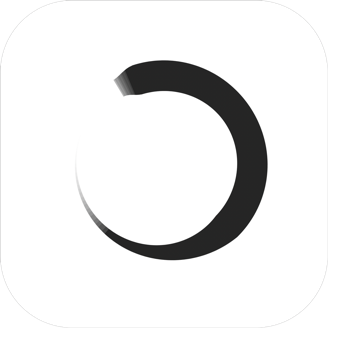
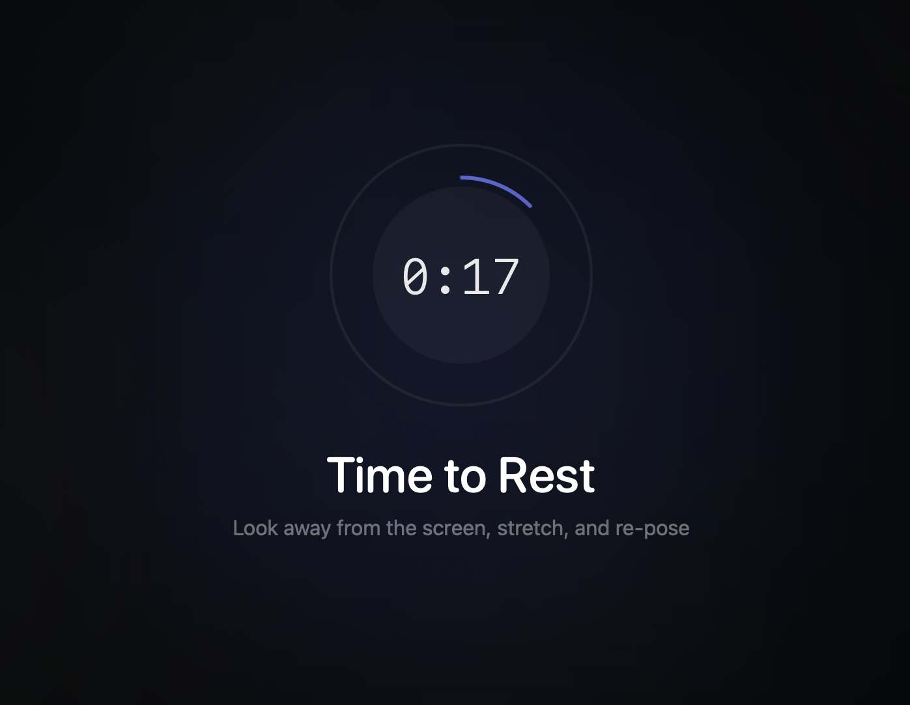

<div align="center">
  
  <h1>Repose</h1>
  <p><strong>Take breaks from your screen. Without interrupting your meetings.</strong></p>
  <a href="https://github.com/fikrikarim/repose/releases/latest/download/Repose.dmg">
    
  </a>
  <p><sub>Free and open source. Requires macOS 13+.</sub></p>
</div>

<br/>

<div align="center">
  
</div>

<br/>

Repose lives in your menu bar, counts down your work interval, and dims your screen when it's time to rest your eyes. When the break ends, the cycle starts again.

The difference from every other break reminder: **Repose detects when you're in a meeting and stays out of your way.** No calendar integration, no app-specific setup. If your camera or mic is active, it knows you're on a call and waits.

## How it works

1. Set your work interval (1–60 min) and break duration (10 sec–5 min)
2. A countdown appears in your menu bar
3. When time's up, your screen dims with a gentle reminder to look away
4. If you're on a call, the timer pauses automatically until you're done

<div align="center">
  
</div>

Everything is in the menu — pause, resume, restart, all settings. No separate preferences window.

## Why the meeting detection actually works

Most break apps check your calendar or look for specific apps running. Both break easily — your calendar doesn't know about the impromptu call your manager just started, and "Zoom is open" doesn't mean you're in a meeting.

Repose checks the hardware directly. It uses CoreMediaIO to detect active cameras and CoreAudio for microphones. If something is using your camera or mic right now, you're probably in a call, so it backs off.

This means it works with Zoom, Meet, FaceTime, Teams, Slack huddles, and whatever you end up using next year. Zero configuration.

## Install

### Download

[Download the latest DMG](https://github.com/fikrikarim/repose/releases/latest/download/Repose.dmg), open it, and drag Repose to Applications.

Updates are handled automatically via Sparkle.

### Build from source

```
git clone https://github.com/fikrikarim/repose.git
cd repose
brew install xcodegen
xcodegen generate
open Repose.xcodeproj
```

Requires Xcode 15+ and macOS 13+.

## License

MIT
